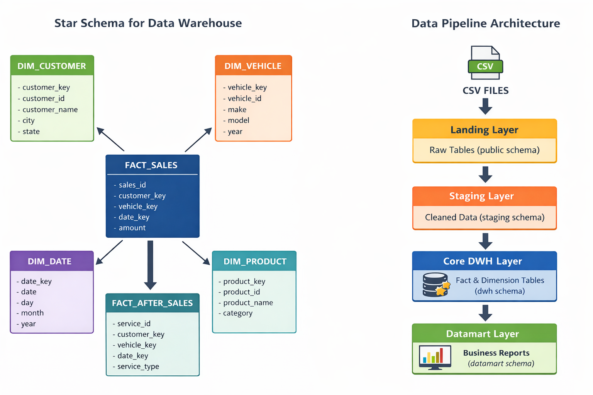

# 🚀 Data Pipeline Project: AstraWorld Pipeline

---
## Overview

Perusahaan retail otomotif "Maju Jaya" "sedang membangun data warehouse untuk mengelola data retail otomotif, migrasi dari Excel ke sistem modern dengan Python, PostgreSQL, dan Airflow.

Pipeline mendukung:
- Ingest data mentah dari file CSV dan database.
- Transformasi & clean-up di staging layer.
- Generate report bisnis di datamart.
- Automasi harian (daily) melalui Airflow DAG.

---

## 📂 Struktur Project

```
AstraWorld-Pipeline-Project/
│
├── pipeline/
│   ├── ingest_customer_addresses.py      # Landing layer: ingest CSV dari sumber eksternal ke folder raw
│   ├── staging_customer_addresses.py     # Staging layer: cleaning, transformasi, dan load data ke schema staging
│   ├── run_dwh.py                        # DWH layer: membangun tabel data warehouse (fact & dimension) dari data staging 
│   └── run_datamart.py                   # Datamart layer: generate dataset analitik dari data warehouse
│
├── data/
│   ├── landing/                          # File CSV mentah dari sumber eksternal (data source)
│   ├── raw/                              # File yang sudah dipindahkan dari landing sebagai input pipeline
│   │
│   ├── staging/                          # Layer penyimpanan hasil transformasi awal sebelum masuk ke Data Warehouse
│   │   ├── data/                         # Output hasil transformasi staging per tanggal (CSV snapshot)
│   │   └── query/                        # Query SQL untuk cleaning dan transformasi data staging
│   │       └── customer_addresses.sql
│   │
│   ├── dwh/                              # Core Data Warehouse (Star Schema)
│   │   ├── schema/                       # DDL untuk membuat tabel dimension dan fact
│   │   │   ├── dim_customer.sql
│   │   │   ├── dim_vehicle.sql
│   │   │   ├── dim_date.sql
│   │   │   ├── fact_sales.sql
│   │   │   └── fact_after_sales.sql
│   │   │
│   │   └── query/                        # Query ETL untuk memuat data dari staging ke DWH
│   │       ├── load_dim_customer.sql
│   │       ├── load_dim_vehicle.sql
│   │       ├── load_dim_date.sql
│   │       ├── load_fact_sales.sql
│   │       └── load_fact_after_sales.sql
│   │
│   └── datamart/                         # Dataset analitik siap untuk reporting atau dashboard
│       ├── data/                         # Output dataset datamart dalam bentuk CSV
│       └── query/                        # Query SQL untuk membuat dataset analitik
│           ├── sales_summary.sql
│           └── service_priority.sql
│
├── docs/                                 # Dokumentasi arsitektur pipeline
│   ├── landing_layer.md
│   ├── staging_layer.md
│   ├── dwh_layer.md
│   ├── datamart_layer.md
│   └── airflow.md
│
├── airflow/
│   └── dags/
│       └── dag_pipeline.py               # DAG Airflow untuk menjalankan pipeline ETL harian
│
├── config.py                             # Konfigurasi koneksi PostgreSQL
├── docker-compose.yml                    # Environment Airflow + PostgreSQL
└── README.md                             # Dokumentasi utama project
```

---


## ⭐ Skema Bintang (Star Schema)

**Star Schema** adalah model desain data warehouse yang mengorganisasi data ke dalam dua jenis tabel utama:

* **Fact Table** → menyimpan **data transaksi atau metrik bisnis**
* **Dimension Table** → menyimpan **atribut deskriptif** yang digunakan untuk analisis

<p align="center">
  
</p>

Pada model ini, **fact table berada di tengah** dan terhubung ke beberapa **dimension table**, sehingga bentuknya menyerupai **bintang**.

Keuntungan menggunakan Star Schema:

* Query analisis menjadi **lebih cepat dan sederhana**
* Struktur data **mudah dipahami oleh analis**
* Mendukung **OLAP dan business intelligence**

---

## 🔄 Arsitektur Data Pipeline

**Data Pipeline Architecture** menggambarkan alur bagaimana data bergerak dari sumber hingga siap digunakan untuk analisis bisnis.

Pipeline ini terdiri dari beberapa layer pemrosesan data yang memastikan kualitas, konsistensi, dan struktur data sebelum digunakan untuk laporan atau dashboard.


| Layer    | Fungsi                              |
| -------- | ----------------------------------- |
| public   | raw source                          |
| staging  | data cleaning & normalization       |
| dwh      | analytical model (fact & dimension) |
| datamart | business report / aggregation       |


Tahapan utama pipeline:

1. **Landing Layer**

   Data mentah dari sumber eksternal disimpan tanpa perubahan di database.
   ➡️ Detail: [`Landing Layer`](docs/landing_layer.md)

2. **Staging Layer**

   Data dibersihkan, divalidasi, dan dinormalisasi agar memiliki format yang konsisten.
   ➡️ Detail: [`Staging Layer`](docs/staging_layer.md)

3. **Core Data Warehouse Layer**

   Data dimodelkan menggunakan **fact table dan dimension table** untuk analisis.
   ➡️ Detail: [`DWH Layer`](docs/dwh_layer.md)

4. **Datamart Layer**

   Data diolah menjadi **summary atau report bisnis** yang siap digunakan oleh dashboard dan laporan analitik.
   ➡️ Detail:  [`Datamart Layer`](docs/datamart_layer.md)

Pipeline ini memastikan bahwa data yang digunakan untuk analisis sudah melalui proses **cleaning, transformation, dan modeling** secara terstruktur.

---

## ⚙️ Local Setup

Tahapan ini diperlukan supaya pipeline bisa langsung jalan di mesin lokal:

1. **Install Python**

   * Pastikan **Python 3.13** terinstall.
   * Jika belum, download & install dari [python.org](https://www.python.org/downloads/).


2. **Install dependencies**

    ```bash
    pip install -r requirements.txt
    ```

3. **Buat folder data pipeline**

    Pastikan folder berikut ada:
    
    ```
    data/raw/
    data/staging/data/
    data/datamart/data/
    ```

4. **Konfigurasi database**

    Sesuaikan pengaturan koneksi PostgreSQL di file `config.py` (user, password, host, port, db).

    ```
    DB_USER = "postgres"
    DB_PASSWORD = "Krisn@12345"
    DB_HOST = "localhost"
    DB_PORT = "5432"
    DB_NAME = "AstraWorld"
    ```

---

## 📊 Data Source

Pipeline ini menggunakan dua jenis sumber data:

---

### 1️⃣ Operational Database Tables (Existing Source Tables)

Data transaksi utama sudah tersedia di database sumber.

**customers_raw** → data pelanggan

| id | name | dob | created_at |
|----|------|-----|------------|

**sales_raw** → data penjualan kendaraan

| vin | customer_id | model | invoice_date | price | created_at |
|-----|-------------|-------|--------------|-------|------------|


**after_sales_raw** → data layanan purna jual

| service_ticket | vin | customer_id | model | service_date | service_type | created_at |
|----------------|-----|-------------|-------|--------------|--------------|------------|

---

### 2️⃣ Daily CSV File (External Source)

Pipeline juga menerima file harian yang berisi alamat customer terbaru.

```

customer_address_yyyymmdd.csv

```

File ini akan di-ingest pada **Landing Layer** lalu diproses ke **Staging Layer**.

Contoh:

```

customer_address_20260301.csv

```

---

## 🛠 Database

Pipeline menggunakan **PostgreSQL** sebagai database warehouse, dengan struktur schema sebagai berikut:

### **public**

* Menyimpan **tabel master / sumber utama**.
* Contoh: `customers_raw`, `sales_raw`, `after_sales_raw`.
* Data ini bersifat mentah (**raw data**) dan tidak dimodifikasi oleh pipeline.

---

### **staging**

* Menyimpan **tabel hasil transformasi awal** dari raw data.
* Contoh: `customer_addresses`.
* Data di schema ini sudah **dibersihkan, dinormalisasi, dan divalidasi** sehingga memiliki struktur yang konsisten.
* Layer ini berfungsi sebagai **jembatan antara raw data dan data warehouse**.

---

### **dwh (Core Data Warehouse)**

* Menyimpan **model data analitis berbentuk fact table dan dimension table**.
* Data di schema ini berasal dari **transformasi lanjutan dari staging layer**.
* Model yang digunakan biasanya **Star Schema** untuk mendukung analisis yang efisien.

Contoh tabel:

**Dimension Table**

* `dim_customer`
* `dim_vehicle`
* `dim_date`

Dimension table berisi **atribut deskriptif** yang digunakan untuk analisis.

Contoh:

```
dim_customer
```

| customer_key | customer_id | customer_name | city | state |
| ------------ | ----------- | ------------- | ---- | ----- |

---

**Fact Table**

* `fact_sales`
* `fact_after_sales`

Fact table berisi **data transaksi atau metrik bisnis**.

Contoh:

```
fact_sales
```

| sales_key | customer_key | vehicle_key | date_key | amount |
| --------- | ------------ | ----------- | -------- | ------ |

---

Layer **dwh** berfungsi untuk:

* Menyimpan **data historis terstruktur**
* Menjadi **sumber utama analisis**
* Mempermudah pembuatan **report, dashboard, dan data mart**

---

### **datamart**

* Menyimpan **tabel agregasi atau summary** yang siap digunakan untuk analisis bisnis.
* Contoh: `sales_summary`, `service_priority`.
* Data di schema ini berasal dari **query agregasi terhadap tabel di layer dwh**.
* Biasanya digunakan langsung oleh **dashboard BI atau laporan harian**.


---


* **Konfigurasi Koneksi**

  * Semua pengaturan koneksi database (user, password, host, port, nama database) ada di file: `config.py`.
  * File ini digunakan oleh semua script pipeline (`ingest_customer_addresses.py`, `staging_customer_addresses.py`, `run_datamart.py`) untuk terkoneksi ke database PostgreSQL.

---

## ⚙️ Airflow DAG

Pipeline dijalankan otomatis setiap hari menggunakan **Airflow DAG**, agar semua layer ETL berjalan berurutan.

* **File DAG:** `airflow/dags/dag_pipeline.py`

**Alur pipeline:**

```
Landing (ingest_customer_addresses.py)
       ↓
Staging (staging_customer_addresses.py)
       ↓
Datamart (run_datamart.py)
       ├─ sales_summary
       └─ service_priority
```

Untuk detail setup, trigger manual, dan monitoring, bisa dilihat disini: ➡️ [`Airflow`](docs/airflow.md)

---

## 🐳 Docker Compose

Menjalankan **seluruh environment pipeline secara lokal** secara cepat dan terisolasi.

* Menjalankan **PostgreSQL + Airflow** dalam container.
* Airflow executor: `LocalExecutor`.
* Airflow webserver: [http://localhost:8080](http://localhost:8080)
* DAG pipeline otomatis muncul setelah container berjalan.

Untuk panduan setup container lengkap, bisa dilihat disini:  ➡️ [`Docker Compose`](docs/docker.md)

---

## ⏱ DAG Harian

DAG harian mengatur alur pipeline ETL agar otomatis dijalankan setiap hari:

* **Flow:**

```text
Landing (ingest_customer_addresses.py)
       ↓
Staging (staging_customer_addresses.py)
       ↓
Datamart (run_datamart.py)
       ├─ sales_summary
       └─ service_priority
```

* **Schedule:** setiap hari jam 02:00
* **Catchup:** False (tidak mengejar tanggal yang terlewat)

DAG akan otomatis mengeksekusi pipeline sesuai urutan di atas, termasuk logging dan monitoring task.

